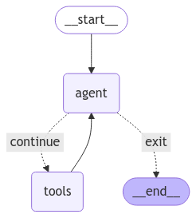

# RAG-n-ROLL

## Inspiration

As someone constantly lost in a shopping mall and don't find interactive maps in shopping malls intuitive, I always think that my shopping experience would be better if there was a RAG app that uses frequently asked questions about that location as its source of truth to answer my questions. Questions such as "What time does the dining floor close?" or "Where are the restrooms located on the 2nd floor?" are very commonly asked (or thought of) but whose answers are not immediately clear from the FAQ page or the mall map. This app fills in that gap.

## What it does

This is a streamlit app whose default dataset is FAQ of a fictitious Whoville Shopping Mall. If you're using the default dataset, you can chat with the app as if you're chatting with a Whoville Shopping Mall information desk person. You can keep track of your chat history but also you can delete your chat history and start over mid-session if you wish. The sample document used in the backend can be found in [./sample_documents](./sample_documents) directory in the repo.

However, this app also lets you upload any other DOCX file and use it as your source of truth. The uploaded file will be split, embedded and indexed into a Snowflake Cortex vector store to help you use it as your source of truth. However, it is important to note that after you finish your session with the app, you lose access to all previous chat history and uploaded documents.

## How we built it

There are two main components to this app:
- data ingestion
- chat

Data ingestion is the step where you upload a DOCX file, and the data is read, recursively split, embedded and stored in a Snowflake Cortex vector store. All of this heavily relies on existing langchain framework as well as custom code that integrates Snowflake Cortex into langchain. The Python code that handles this part of the code can be found in the [./utils/ingest.py](./utils/ingest.py) file in the repo.

The second component is the chat component whose frontend uses streamlit. When you enter a question into the input field, it is embedded and a vector similarity search will be done over the vector store to retrieve the most similar documents and these documents are used as context to generate an answer.

Architecturally, this second component app is a ReAct agent whose overall agent workflow is as follows:



There are 2 `tools` node that can be called in the `tools` node: `retriever` and `date`; the former is for retrieving relevant context from the vector store to help answer questions and the latter is usefule to make the agent "aware" of datetime. Mistral AI's function calling feature comes in handy here. The `agent` node is a function calling mistral-large-latest model with `temperature=0.1`.


## Challenges we ran into

There was no langchain vector store or embedding function for Snowflake Cortex out of the box so I had to write `SnowflakeCortexVectorStore` and `SnowflakeCortexEmbeddings` classes that build on langchain `VectorStore` and `Embeddings` objects.

`SnowflakeCortexEmbeddings` was relatively easy to write because there `snowflake-cortex` package has `embed_text_768` and `embed_text_1024` functions out of the box so it was a matter of using these functions in the `embed_*` method definitions.

`SnowflakeCortexVectorStore` was a little more involved as creating database, schema, warehouse and doing `VECTOR_COSINE_SIMILARITY` computations are all handled in SQL. Since many of the methods required executing SQL commands while binding custom input, a lot of thought was put into the design to safeguard against SQL injection attacks.

## Accomplishments that we're proud of

Integrating Snowflake Cortex vector store into a langgraph agent workflow.

## What we learned

Snowflake Cortex and Mistral AI are very useful frameworks to create GenAI apps. I was especially impressed with the thoroughness of Snowflake documentation and how helpful it was. Moving forward, I will look into integrating them into my own workflows.


## What's next

The most obvious place where we could improve the app is to change the agent model into something different. Currently, it implements a ReAct agent but one could change it to Self-RAG model to improve the retrieval process but one could also change it to AStar or MonteCarlo Tree Search model to improve the answering process, especially because MistralAI allows batch inference anyway.

---

## Prerequisite

1. Python >= 3.11

## Setup

1. Clone this repo and `cd` into the directory it is cloned in.

2. Create virtual environment

    ```shell
    python -m virtualenv venv
    source ./venv/Scripts/activate
    ```

3. Install dependencies

    ```shell
    pip install -r requirements.txt
    ```

4. Create an `.env` file that looks like

    ```ini
    MISTRAL_API_KEY=YOUR_KEY_HERE
    SNOWFLAKE_ACCOUNT=YOUR_ACCOUNT_IDENTIFIER_HERE
    SNOWFLAKE_USER=YOUR_USERNAME_HERE
    SNOWFLAKE_PASSWORD=YOUR_PASSWORD_HERE
    ```

## Running the App

It can be run locally via the following command in the CLI:

    ```shell
    streamlit run app.py
    ```
